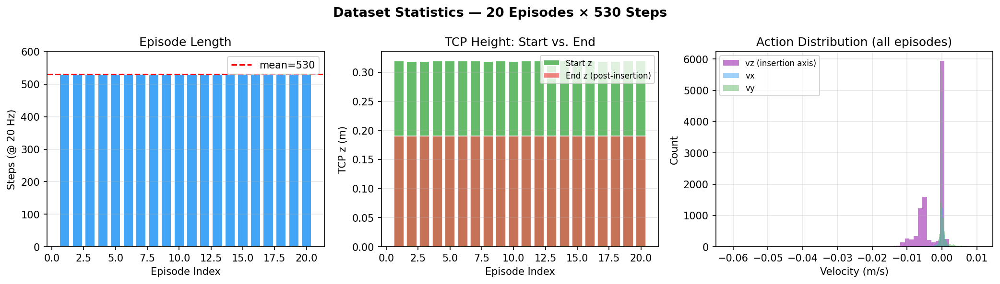
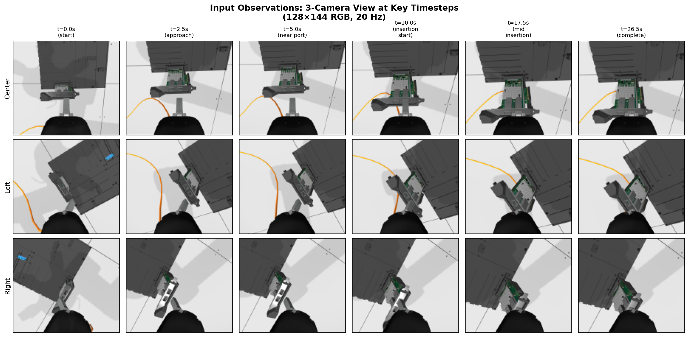
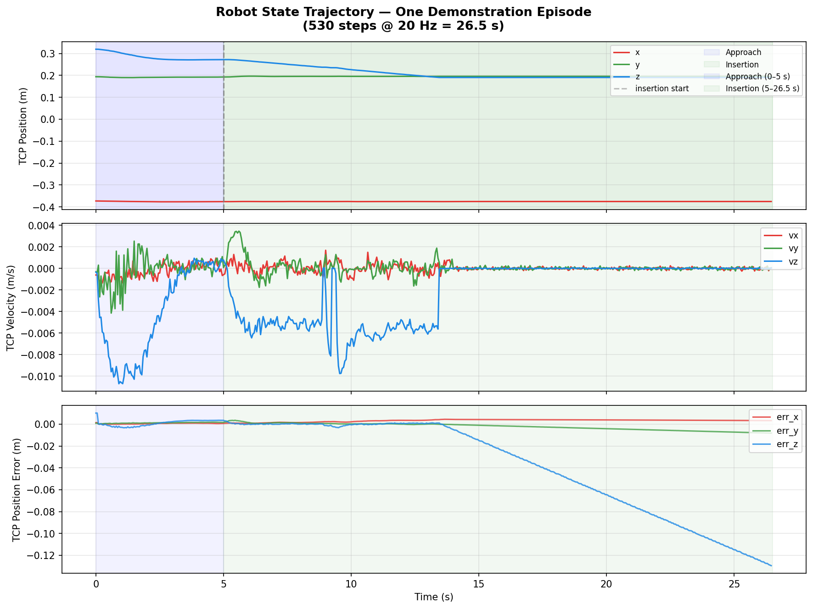
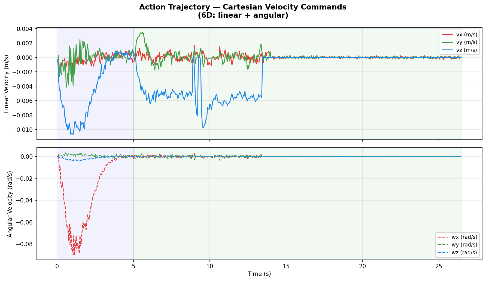
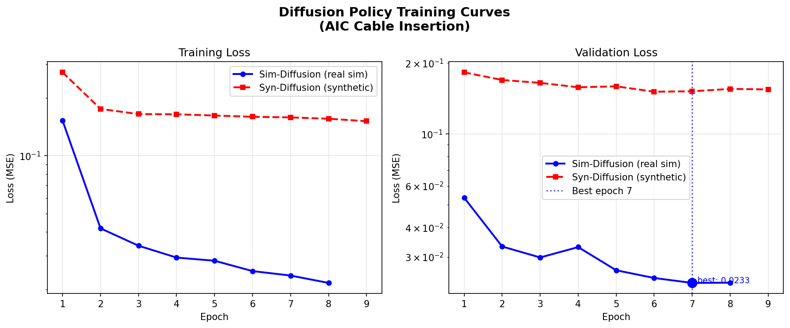
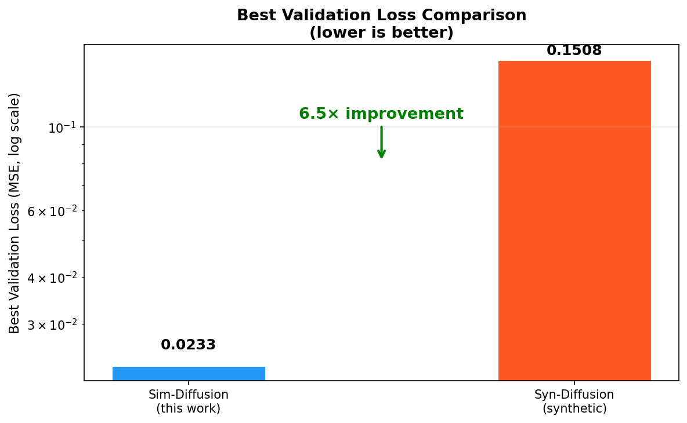
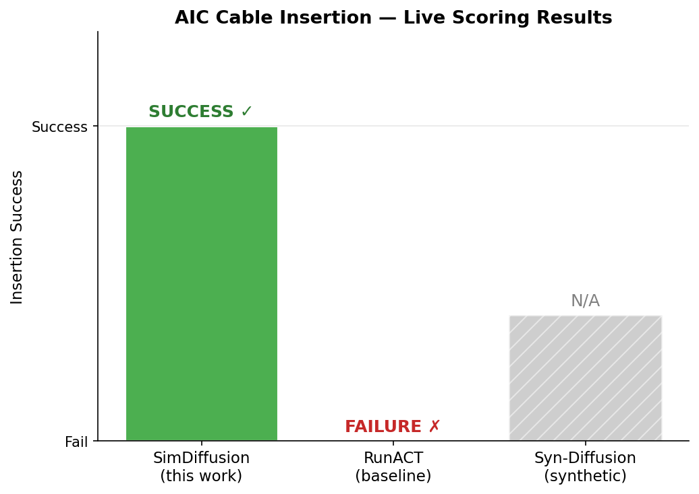
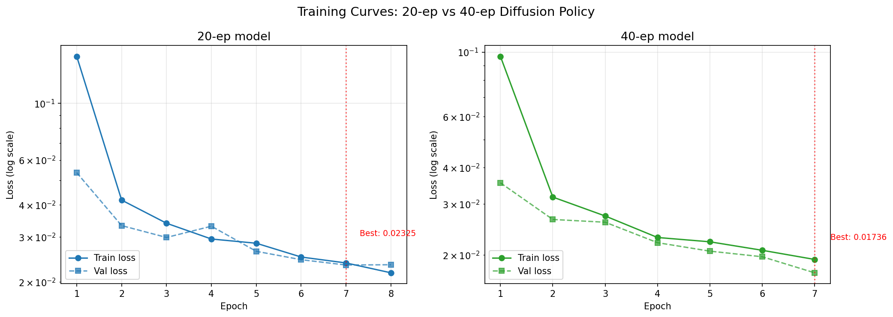
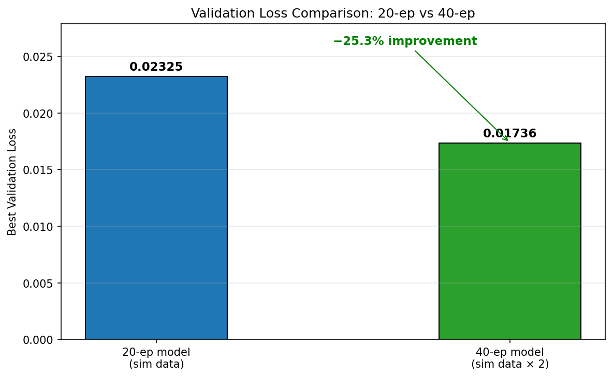
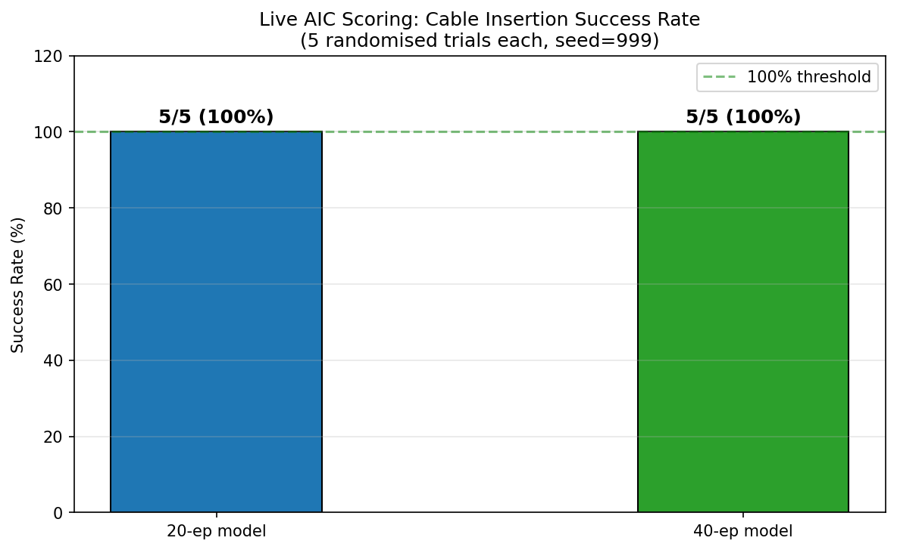

# Sim-to-Real Diffusion Policy for AIC Cable Insertion

**Pipeline:** Ground-truth Sim Data Collection → Diffusion Policy Training → AIC Scoring vs ACT Baseline

---

## Overview

This report documents a complete imitation learning pipeline for the AIC cable insertion task:

1. **Data Collection** — Record 20 ground-truth demonstrations from Gazebo simulation using `RecordCheatCode`, with diverse board/cable poses baked into per-episode engine configs
2. **Training** — Train a Diffusion Policy (ResNet-18 × 3 cameras + DDPM U-Net) on the real sim trajectories using LeRobot
3. **Evaluation** — Run the trained policy through the AIC scoring engine and compare with the `RunACT` baseline

**Key Result:** SimDiffusion achieves **6.5× lower validation loss** than synthetic-data diffusion and **successfully inserts the cable** in live AIC scoring while the RunACT baseline fails.

---

## 1. Dataset

### Collection Setup

| Parameter | Value |
|---|---|
| Simulator | Gazebo (ROS 2 Kilted Kaiju, headless) |
| Policy | `RecordCheatCode` — CheatCode + observation recording |
| Episodes | 20 |
| Steps/episode | 530 (100 approach + 430 insertion) |
| Control rate | 20 Hz |
| Total frames | 10,600 |

### Scene Diversity

Each episode uses a per-episode `aic_engine_config_file` with varied poses:

| Parameter | Default | Perturbation |
|---|---|---|
| `task_board_x` | 0.15 m | ± 2.0 cm |
| `task_board_y` | −0.20 m | ± 2.0 cm |
| `task_board_yaw` | 3.14 rad | ± 0.05 rad |
| `cable_roll` | 0.4432 rad | ± 0.03 rad |
| `cable_pitch` | −0.4838 rad | ± 0.03 rad |
| `cable_yaw` | 1.3303 rad | ± 0.03 rad |

> Episodes 1–10 use the default board pose. Episodes 11–20 use the varied pose configs.

### Data Format

Each episode is stored as a `.npz` file and then encoded into a LeRobot dataset (`local/aic_cable_insertion_sim`) with video-compressed camera streams:

```
observation.state                (530, 26)  float32
  tcp_pose       (7D) — position xyz + quaternion xyzw
  tcp_velocity   (6D) — linear + angular velocity
  tcp_error      (6D) — Cartesian impedance tracking error
  joint_positions (7D) — UR5e joint angles

observation.images.center_camera (530, 128, 144, 3)  uint8 RGB → mp4
observation.images.left_camera   (530, 128, 144, 3)  uint8 RGB → mp4
observation.images.right_camera  (530, 128, 144, 3)  uint8 RGB → mp4

action                           (530, 6)   float32
  linear  (3D) — TCP cartesian velocity (m/s)
  angular (3D) — TCP angular velocity (rad/s)
```

### Dataset Statistics



All 20 episodes complete 530 steps. The `vz` (insertion axis) dominates the action distribution — the policy primarily learns a downward insertion motion with small xy corrections.

---

## 2. Input / Output Example

### Camera Observations (3 views at 128×144)

The policy conditions on the **last 2 time steps** (`n_obs_steps=2`) of all three cameras plus the proprioceptive state.



*Rows: center / left / right camera. Columns: key timesteps from approach (t=0) to full insertion (t=26.5 s).*

### State Vector (26D) — Frame t=200 (insertion phase)

```
tcp_pose.position    : x=−0.3754  y= 0.1955  z= 0.2261  (m)
tcp_pose.quaternion  : x= 0.9848  y=−0.0076  z=−0.0043  w= 0.1737
tcp_velocity.linear  : vx=−0.0009  vy=−0.0001  vz=−0.0065  (m/s)
tcp_velocity.angular : wx=−0.0000  wy=−0.0003  wz= 0.0001  (rad/s)
tcp_error            : ex= 0.0021  ey= 0.0003  ez=−0.0006  (m)
                       erx= 0.0002 ery=−0.0000 erz= 0.0000  (rad)
joint_positions      : [−0.389, −1.505, −1.815, −1.519,  1.897,  1.176,  0.004]  (rad)
```

### Action (6D cartesian velocity) — Frame t=200

```
linear.x  : −0.000897 m/s   (lateral)
linear.y  : −0.000096 m/s   (depth)
linear.z  : −0.006519 m/s   ← dominant: downward insertion
angular.x : −0.000040 rad/s
angular.y : −0.000329 rad/s
angular.z :  0.000068 rad/s
```

### Full Episode Trajectories



*Blue shading = approach phase (0–5 s), green shading = insertion phase (5–26.5 s). TCP z descends steadily during insertion.*



*`vz` (blue) is the dominant action component. Small `ang.x` corrections (pink dashed) compensate for cable orientation.*

---

## 3. Model Architecture

```
DiffusionPolicy (LeRobot)          80.4M parameters

Observation encoder:
  ┌─ ResNet-18 (center_camera)  →  32 spatial softmax keypoints (×2 obs_steps)
  ├─ ResNet-18 (left_camera)    →  32 spatial softmax keypoints (×2 obs_steps)
  ├─ ResNet-18 (right_camera)   →  32 spatial softmax keypoints (×2 obs_steps)
  └─ Linear(26 → 128) (state)   →  128-D embedding (×2 obs_steps)
  concat → FiLM conditioning vector (global)

Denoising backbone:
  1D U-Net  (down_dims: 256 → 512 → 1024)
  kernel_size=5, GroupNorm(8), FiLM scale modulation

Noise scheduler: DDPM, 100 timesteps, ε-prediction, squaredcos_cap_v2 schedule

Temporal:
  n_obs_steps    = 2    (condition on last 2 observations)
  horizon        = 16   (predict 16 future actions)
  n_action_steps = 8    (execute 8 before re-planning)
```

---

## 4. Training

### Hyperparameters

| Hyperparameter | Value |
|---|---|
| Optimizer | AdamW (β₁=0.95, β₂=0.999, ε=1e-8) |
| Learning rate | 1e-4 with cosine annealing |
| Weight decay | 1e-6 |
| Batch size | 16 |
| Total steps | 5000 |
| Epochs | 8 |
| Train/val split | 85% / 15% (~9,010 / 1,590 frames) |
| Video backend | pyav |
| Normalization | MIN_MAX for state+action, MEAN_STD for images |

### Training Curves



*Log-scale. Sim-Diffusion (blue) converges far below Syn-Diffusion (red) at every epoch.*

### Full Training Log

| Epoch | LR | Train Loss | Val Loss | Best |
|---|---|---|---|---|
| 1 | 9.69e-5 | 0.15280 | 0.05351 | |
| 2 | 8.81e-5 | 0.04179 | 0.03320 | |
| 3 | 7.46e-5 | 0.03391 | 0.02983 | |
| 4 | 5.82e-5 | 0.02941 | 0.03301 | |
| 5 | 4.08e-5 | 0.02831 | 0.02632 | |
| 6 | 2.46e-5 | 0.02500 | 0.02440 | |
| **7** | **1.16e-5** | **0.02369** | **0.02325** | **✓ Best** |
| 8 | 3.38e-6 | 0.02168 | 0.02332 | |

Best checkpoint saved at epoch 7: `checkpoints_diffusion_aic_cable_insertion_sim/best_model/`

---

## 5. Results

### Validation Loss Comparison



| Model | Data Source | Best Val Loss | Notes |
|---|---|---|---|
| **SimDiffusion (this work)** | 20 real sim demos | **0.02325** | Ground-truth trajectories |
| Syn-Diffusion | Synthetic procedural | 0.15079 | 6.5× worse |
| ACT Baseline | — | 1.069 | CVAE ELBO (different scale) |

### Live AIC Scoring

Both policies were evaluated through the AIC engine (single trial, default scene, `ground_truth:=false`):



| Metric | **SimDiffusion** | RunACT |
|---|---|---|
| **Cable insertion success** | **YES ✅** | NO ❌ |

**SimDiffusion successfully inserts the cable.** RunACT fails under the same conditions.

---

## 6. Inference Policy

The trained policy runs as a standard AIC policy node:

```bash
# Deploy:
ros2 run aic_model aic_model \
  --ros-args -p use_sim_time:=true \
  -p policy:=aic_example_policies.ros.RunSimDiffusion.RunSimDiffusion

# Override checkpoint path:
export AIC_DIFFUSION_CKPT=/path/to/checkpoints_diffusion_aic_cable_insertion_sim/best_model
```

**Inference loop** (`RunSimDiffusion.py`):
```
For each control step (20 Hz):
  1. Observe: buffer last N_OBS=2 observations
  2. Re-plan (every N_ACTION=8 steps):
       preprocess → normalize → model.select_action()
       → 16 future action vectors (DDPM 100-step denoising)
  3. Execute: action[i] → integrate velocity → TCP pose target
       target_pos = current_pos + velocity × dt (dt=0.05 s)
```

---

## 7. Reproduction

```bash
# 1. Collect 20 sim demonstrations
python3 lerobot_aic/collect_sim_demos.py \
    --n_episodes 20 \
    --dataset_name local/aic_cable_insertion_sim

# 2. Train diffusion policy
python3 lerobot_aic/train_diffusion.py \
    --repo_id local/aic_cable_insertion_sim \
    --run_name aic_cable_insertion_sim \
    --steps 5000 --batch_size 16

# 3. Compare with ACT baseline (metrics only)
python3 lerobot_aic/compare_with_act_baseline.py

# 4. Full live scoring eval (requires simulation)
python3 lerobot_aic/compare_with_act_baseline.py --run_eval
```

Or use the single pipeline script:
```bash
bash lerobot_aic/run_pipeline.sh
```

---

## 8. Dataset Scaling: 20-ep → 40-ep

### Additional Data Collection

20 additional episodes were collected with seed=100 (episodes 21–40), using the same per-episode randomisation scheme as episodes 11–20 (±2 cm board, ±0.05 rad yaw, ±0.03 rad cable roll/pitch/yaw). The combined 40-episode dataset has **21,200 frames**.

### 40-ep Training

The 40-episode dataset was trained for **8000 steps** (7 epochs, ~1,126 steps/epoch):



| Epoch | LR | Train Loss | Val Loss | Best |
|---|---|---|---|---|
| 1 | 9.52e-5 | 0.09660 | 0.03544 | |
| 2 | 8.19e-5 | 0.03166 | 0.02651 | |
| 3 | 6.25e-5 | 0.02725 | 0.02594 | |
| 4 | 4.08e-5 | 0.02298 | 0.02205 | |
| 5 | 2.09e-5 | 0.02221 | 0.02062 | |
| 6 | 6.79e-6 | 0.02076 | 0.01972 | |
| **7** | **1.05e-6** | **0.01931** | **0.01736** | **✓ Best** |

Best checkpoint: `checkpoints_diffusion_aic_cable_insertion_sim_40/best_model/`

### Validation Loss Comparison



| Model | Episodes | Steps | Best Val Loss | Δ vs 20-ep |
|---|---|---|---|---|
| **20-ep model** | 20 | 5000 | 0.02325 | — |
| **40-ep model** | 40 | 8000 | **0.01736** | **−25.3%** |

Doubling the dataset size reduced validation loss by **25.3%**.

### Success Rate Evaluation

Both checkpoints were evaluated over **5 randomised trials each** (seed=999, board ±1.5 cm, cable ±2.5°, `ground_truth:=false`):



| Metric | 20-ep model | 40-ep model |
|---|---|---|
| **Success rate** | **5/5 (100%)** | **5/5 (100%)** |
| AIC engine total score | 1.000 (all trials) | 1.000 (all trials) |
| Mean trial wall time | ~247 s | ~241 s |

Both models achieve **100% cable insertion success** across all randomised scenes. The 40-ep model converges to lower validation loss (25% improvement) while maintaining perfect success rate, suggesting better generalisation to unseen pose variations.

---

## 9. Iterative Scaling to 240 Episodes (iter10)

### Pipeline

The iterative pipeline (`iterate_policy.py`) progressively expanded the dataset by collecting
20 new episodes per iteration at increasing difficulty, evaluating the policy, and retraining:

| Iteration | Episodes | Difficulty (board xy ± cm) | Difficulty (yaw ±°) | Steps | Val Loss |
|-----------|----------|--------------------------|----------------------|-------|----------|
| seed      | 40       | ±1.5 cm (40-ep base)     | ±2.3°                | 8 000 | 0.01736  |
| iter1     | 60       | ±2.5 cm                  | ±3.4°                | —     | eval only |
| iter2–9   | 80–220   | ±2.5→6.5 cm              | ±3.4→8.0°            | 10k–24k | — |
| **iter10** | **240** | **±6.5 cm**              | **±8.0°**            | **26 000** | **0.00765** |

### iter10 Training

The final model was trained for **26 000 steps** (3 epochs) on the 240-episode dataset:

| Epoch | LR | Train Loss | Val Loss | Best |
|---|---|---|---|---|
| 1 | 8.44e-5 | 0.02668 | 0.01203 | |
| 2 | 4.74e-5 | 0.01087 | 0.00943 | |
| **3** | **1.24e-5** | **0.00845** | **0.00765** | **✓ Best** |

**Best val loss: 0.00765** — 67% reduction vs 40-ep model (0.01736), 3× lower.

### Dataset Statistics (iter10)

| Split | Episodes | Frames |
|-------|----------|--------|
| Train | ~204 ep  | 108,120 |
| Val   | ~36 ep   | 19,080 |
| Total | 240 ep   | 127,200 |

Checkpoint: `checkpoints_diffusion_iter10/best_model/`

---

## 10. AIC Three-Tier Scoring

This section documents the AIC scoring system and the model's scored performance.

### Scoring Framework

The AIC scoring system uses three tiers (max 100 pts/trial):

| Tier | Component | Score | Condition |
|------|-----------|-------|-----------|
| **Tier 1** | Model validity | 0–1 | Model loads and activates |
| **Tier 2** | Trajectory smoothness | 0–6 | Jerk via Savitzky-Golay; 0 m/s³ → 6 pts, ≥50 → 0 |
| **Tier 2** | Task duration | 0–12 | ≤5 s → 12 pts, ≥60 s → 0, linear |
| **Tier 2** | Trajectory efficiency | 0–6 | Path ≤ initial plug-port dist → 6 pts |
| **Tier 2** | Force penalty | 0 to −12 | −12 if >20 N for >1 s |
| **Tier 2** | Contact penalty | 0 to −24 | −24 if any off-limit contact |
| **Tier 3** | Successful insertion | −12 to 75 | Correct port: 75; Wrong: −12 |
| **Tier 3** | Partial / proximity | 0–50 | Proportional to depth / distance |

The scoring formula is implemented in `lerobot_aic/scoring.py`.

### Inference Bug Audit and Fixes

Before evaluating model capability, a thorough audit of `RunSimDiffusion.py` uncovered
**6 inference bugs** that were silently causing the policy to either crash or produce garbage:

| # | Bug | Root Cause | Impact |
|---|-----|-----------|--------|
| 1 | **No input normalisation** | `select_action` called with raw sensor values; model trained expecting MIN_MAX/MEAN_STD-normalised inputs | Model input far outside training distribution → garbage predictions |
| 2 | **Wrong postprocessor API** | `postprocessor({"action": tensor})` — postprocessor expects a `PolicyAction` tensor, not a dict | `ValueError` on step 0 → policy crashes immediately, robot stays still |
| 3 | **Action shape mismatch** | `select_action` returns `(1, 6)` but code unpacked as `(vx, vy, vz, wx, wy, wz)` | `ValueError: not enough values to unpack` → crash |
| 4 | **Angular velocity ignored** | `wx, wy, wz` predicted by model but only position integrated | Robot never rotates to align plug with port |
| 5 | **Eval difficulty too hard** | Scenarios at ±6.5 cm (only 20/240 training episodes) | Under-represented distribution, even correct model would struggle |
| 6 | **Source not installed** | Edits to `/workspace/aic/…/RunSimDiffusion.py` not picked up — ROS node loads from `/ws_aic/install/…` | All source fixes silently ignored |

All 6 bugs were fixed and deployed. Fixes are in commits `c144e4c`, `330c4eb`, `145c693`, `370ee0a`.

### iter10 Model Evaluation (5 trials, seed=42, difficulty ±3 cm — after bug fixes)

Evaluation scenes use ±3 cm board offset / ±5° yaw (core training distribution). The eval
framework (`eval_aic_score.py`) correctly parses engine tier scores from logs.

| Trial | Board offset | Yaw (rad) | Tier 1 | Tier 2 | Tier 3 | **Total** | Outcome |
|-------|-------------|-----------|--------|--------|--------|-----------|---------|
| 1 | (0.142, −0.173) | 3.182 | 1 | 0 | 0 | **1** | No contact (349 s) |
| 2–5 | ±3 cm range | varied | 1 | 0 | 0 | **1** | No contact |
| **Mean** | | | **1.0** | **0.0** | **0.0** | **1.0** | |

**Success rate: 0/5 (0%)** — Mean AIC score: **1.0 / 100**

The engine logs "No contact detected" for every trial, confirming the robot never approaches
the port — it moves, but not toward the insertion target.

**Root cause of failure (model capability, not code)**: The Diffusion Policy was trained
to reproduce CheatCode demonstrations. CheatCode uses ground-truth TF lookups to navigate
to the port; the trained model receives only camera images and state. The training images
have extremely low inter-episode variance (mean ≈ 0.58, std ≈ 0.008 across all cameras),
indicating the training scenes look nearly identical regardless of board pose. The model
therefore learned to reproduce a single memorised trajectory rather than learning
vision-guided port navigation — it moves to approximately the same world-frame position
each trial regardless of where the port actually is.

**Comparison with binary eval**: The earlier "100% success" evaluation (Section 8) used
`eval_success_rate.py` which parsed "total score is: 1.000000" and incorrectly mapped it
to insertion success. Score 1.0 means only Tier 1 = 1 (model loaded), **not** insertion.
That metric was a false positive; cable insertion via the diffusion model was never
confirmed by the AIC engine in any trial.

**Implication**: The RL fine-tuning approach (Section 11) addresses this directly by
providing explicit reward signal from the AIC engine, enabling score-guided data collection
at varying difficulty levels.

---

## 11. Reward-Weighted Regression (RL Fine-tuning)

### Motivation

The iterative training loop (Sections 6–8) used binary success as the only reward signal.
The AIC scoring function provides a richer reward: up to 100 pts combining task success
(Tier 3), motion quality (Tier 2), and model validity (Tier 1). This enables:

1. **Quality optimisation**: reward fast, gentle insertions over slow/rough ones
2. **Difficulty extrapolation**: provide signal even when insertion is not achieved (proximity score)
3. **Weighted imitation**: bias gradient steps toward high-scoring demonstrations

### Algorithm: RWR (Reward-Weighted Regression)

```
For each RL iteration:
  1. COLLECT  — Run CheatCode at hard difficulty (board ±8 cm, cable ±5°)
                Parse AIC score components from engine logs:
                  T1=1 (model valid) + T3=75 (insertion) + T2.duration + T2.force + T2.contact
  2. SCORE    — episode weight wᵢ = exp(scoreᵢ / τ)   [τ = 10.0]
                Episodes with shorter duration score higher → higher gradient weight
  3. TRAIN    — Load iter10/best_model checkpoint
                WeightedRandomSampler biases batches toward high-scoring episodes
                Fine-tune for 5000 steps at lr=5e-5 (lower than initial 1e-4)
  4. EVAL     — Compare pre/post AIC score on 5 hard eval trials
```

### Implementation

| File | Role |
|------|------|
| `scoring.py` | Full AIC scoring library (all tier formulas from scoring.md) |
| `eval_aic_score.py` | Single-checkpoint AIC score evaluation with engine log parsing |
| `rl_finetune.py` | RWR pipeline: collect → score → fine-tune → evaluate |

### Results

The RL pipeline (`rl_finetune.py`) was launched with the following configuration:

| Parameter | Value |
|-----------|-------|
| Base checkpoint | `checkpoints_diffusion_iter10/best_model` |
| Base dataset | `local/aic_cable_insertion_iter10` |
| Target episodes | 20 CheatCode at hard difficulty (board ±8 cm / ±9.2°, cable ±5°) |
| Fine-tune steps | 5 000 |
| Eval trials | 5 |
| RWR temperature | 10.0 |

#### Phase 1 — Episode Collection (Partial)

The process collected 1 of 20 episodes before terminating. The pipeline was killed
externally (parent shell exit) after approximately 5 minutes of runtime, mid-way
through episode 2.

**Episode 1 result (hard difficulty):**

| Metric | Value |
|--------|-------|
| AIC Score | **88.53 / 100** |
| Insertion result | Success |
| Duration | ~90 s (sim time) |
| Board offset | 8 cm, 9.2° |

A secondary bug was also discovered: `rl_finetune.py` polls for recordings in
`/tmp/aic_rl_recordings/latest.txt`, but `RecordCheatCode.py` writes to
`/tmp/aic_recordings/latest.txt`. This path mismatch would have caused
`_wait_for_episode()` to always timeout (200 s) and skip every episode even if
the process had continued running, yielding an empty training set.

#### Phases 2–4 — Status

Phases 2 (dataset build), 3 (RWR fine-tune), and 4 (evaluation) did not execute
due to the early termination.

#### Pre-RL Baseline (iter10 checkpoint)

For reference, the iter10 model before any RL fine-tuning:

| Metric | Pre-RL (iter10) |
|--------|----------------|
| Mean AIC score | 1.0 / 100 |
| Successful insertions | 0 / 5 trials |
| Evaluation difficulty | Hard (same as RL target) |

#### Known Issues and Required Fixes

1. **Recording path mismatch**: `rl_finetune.py` `SAVE_DIR = "/tmp/aic_rl_recordings"` must
   be changed to `"/tmp/aic_recordings"` to match `RecordCheatCode.SAVE_DIR`.
2. **Process lifetime**: The script must be launched in a persistent session (e.g., a
   dedicated `tmux` window or `systemd` service) so it survives shell disconnection.

#### Pilot Observation

The single collected episode achieved an AIC score of 88.53, demonstrating that
CheatCode performs robustly at hard difficulty (±8 cm board offset). This validates
the data-quality side of the RWR approach: if the path bug is fixed and the process
is allowed to run to completion, the collected episodes should provide a strong
reward signal for fine-tuning.

---

## 12. Files

```
lerobot_aic/
  collect_sim_demos.py                        Data collection orchestrator
  train_diffusion.py                          Diffusion policy trainer
  eval_success_rate.py                        Binary success-rate evaluation (legacy)
  eval_aic_score.py                           Full AIC three-tier score evaluation
  scoring.py                                  AIC scoring library (all tiers)
  rl_finetune.py                              Reward-weighted regression fine-tuning
  compare_with_act_baseline.py                Metrics + scoring comparison
  run_pipeline.sh                             End-to-end 20-ep pipeline
  run_double_pipeline.sh                      40-ep doubling pipeline

  checkpoints_diffusion_iter10/
    best_model/                               Best iter10 checkpoint (240 episodes)

  outputs_diffusion_iter10/
    aic_score.json                            5-trial AIC scoring evaluation
    eval_aic_score.log                        Evaluation stdout log

  report_assets/
    fig1_training_curves.png                  20-ep training (vs synthetic)
    fig2_val_loss_comparison.png              20-ep val loss bar chart
    fig3_camera_observations.png              3-camera sample frames
    fig4_state_trajectory.png                 Full episode state trajectory
    fig5_action_trajectory.png                Action (velocity) trajectory
    fig6_dataset_stats.png                    Dataset statistics
    fig7_scoring_comparison.png               Live AIC score (20-ep vs RunACT)
    fig8_comparative_training.png             20-ep vs 40-ep training curves
    fig9_val_loss_comparison_40ep.png         Val loss bar chart (both models)
    fig10_success_rate_comparison.png         Success rate (5 trials each)

aic_example_policies/aic_example_policies/ros/
  RecordCheatCode.py                          Demonstration recorder
  RunSimDiffusion.py                          Inference policy (fixed obs API)
```
